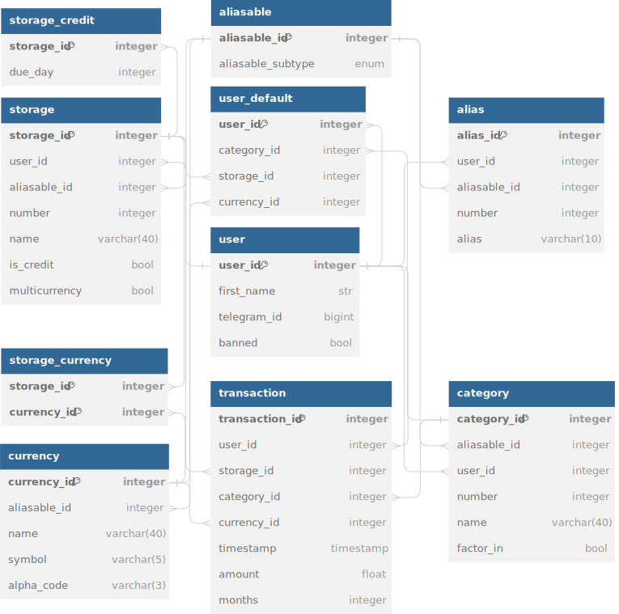

# ₪ Shekels

[Shekels](https://t.me/ilshekelbot) is a fully asynchronous telegram bot for personal finance made with the [aiogram](https://github.com/aiogram/aiogram) framework.  
Shekels is designed to be easy and fast to use &mdash; even more so once you _configure it_.

⚠️ The project is currently under development. Bot is down.

## Features

- Send your transactions in plain text
- Add custom categories and money storages
- Set up aliases for caterogies, storages, and currencies to speed things up
- Set up default categories and storages for even more speed
- View current balance, stats, and clean monthly reports
- 150+ currencies avaliable

<!--
## Overview

### Storages

### Categories

### Aliases
-->

## Technologies
<!--

-->

- [Aiogram 3.x](https://github.com/aiogram/aiogram)
- [Sqlalchemy 2.x](https://www.sqlalchemy.org/)
- [Pydantic 2.x](https://github.com/pydantic/pydantic)
- [Poetry](https://python-poetry.org/)
- [Postgresql](https://www.postgresql.org/)
- [Redis](https://redis.io/)

## Data model

(made with [dbdiagram.io](https://dbdiagram.io/))

## Usage

- Get a bot token from [BotFather](https://t.me/botfather)
- Add an .env file with bot token and other settings specified in `bot.config.Settings`
- Install `poetry` and run `poetry init` command in project root
- Run `bot/main.py`
